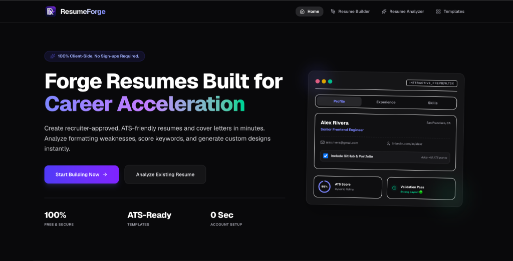
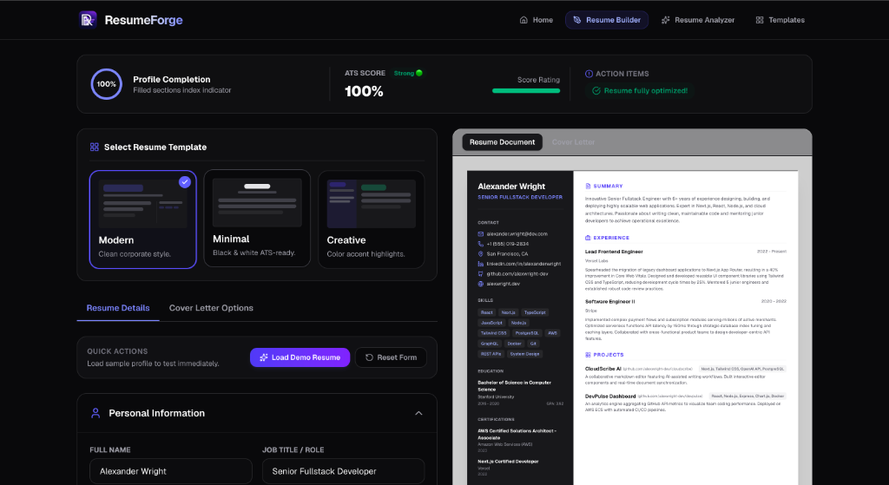
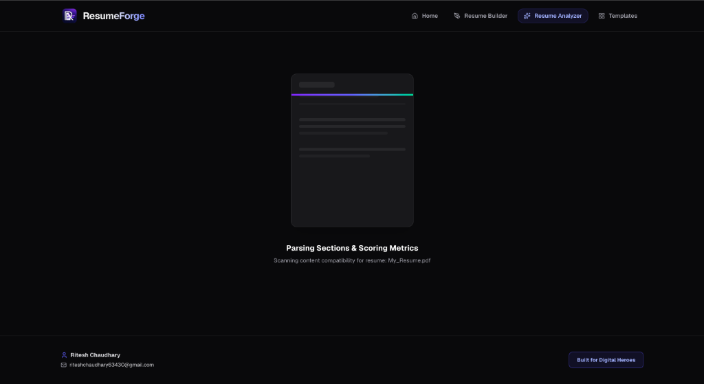
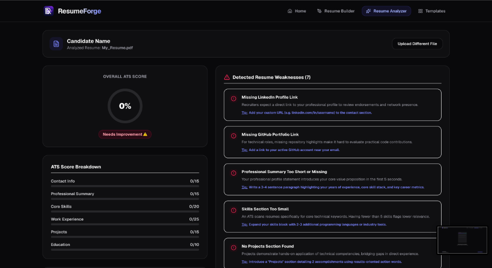
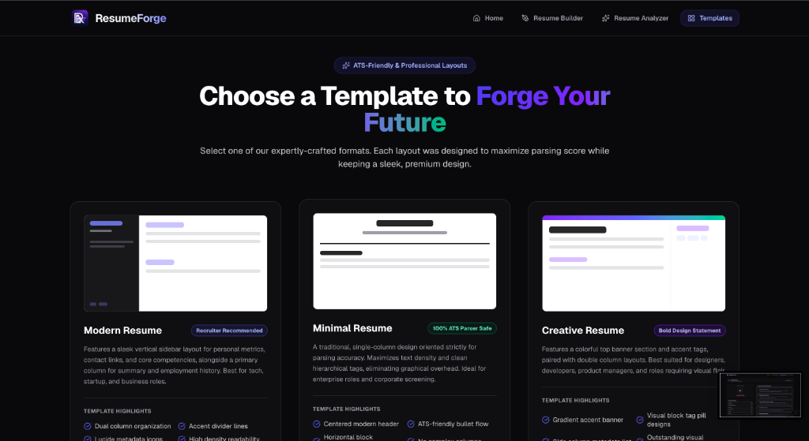

# 🚀 ResumeForge

<div align="center">

[](https://nextjs.org/)
[](https://react.dev/)
[](https://tailwindcss.com/)
[](https://www.typescriptlang.org/)

**A premium, 100% client-side ATS Resume Builder, Structural Diagnostic Analyzer, and Job Description Matcher.**

[🌐 Explore the Live Site](https://www.resumeforge.buzz)

---



</div>

---

## ✨ Key Features

### 🛠️ Interactive Resume Builder
* **Live Side-by-Side Preview**: Instantly see formatting adjustments render on the page as you edit details.
* **Three Professional Layouts**:
  * **Modern**: Features a sleek vertical sidebar for personal details, contact links, and core competencies, alongside a primary column for summary and employment/project history.
  * **Minimal**: A traditional, single-column design oriented strictly for parsing accuracy. Maximizes text density and clean hierarchical tags.
  * **Creative**: Features a colorful top banner and accent tags, paired with double column layouts. Perfect for designers, product managers, and roles requiring visual flair.
* **Cohesive Cover Letter Generator**: Generates a matching cover letter utilizing the same visual header and layout structure as your resume.

### 🔍 Interactive Resume Analyzer
* **Client-Side Parsing**: Upload your existing PDF or DOCX resume to extract text locally using **PDF.js** and **Mammoth**. No data is ever uploaded to a server.
* **ATS Structural Diagnostic**: Automatically parses your text to detect standard structural sections (Summary, Skills, Experience, Projects, Education, Certifications) and calculate an overall ATS score out of 100.
* **Problem & Weakness Detection**: Identifies missing contact info, short professional summaries, tiny skills sections, missing project links, and more. Gives actionable, line-by-line recommendation tips to fix them.

### 🎯 Job Description Compatibility Matcher
* Paste a target job posting description to compare text keywords against your parsed resume keywords.
* Calculates a dynamic **compatibility score** and highlights missing technologies so you can customize your resume for specific job descriptions before sending.

### 🔒 Privacy-First (100% Client-Side)
* **Zero Logins, Zero Databases**: All parsing, metrics calculation, letter formatting, and PDF exporting occur directly in your browser. 
* Safe from data leaks, and runs completely locally.

---

## 📸 App Screenshots & Walkthrough

<details>
  <summary><b>💼 1. Interactive Resume Builder (Edit Form & PDF Preview)</b></summary>
  <br>
  
</details>

<details>
  <summary><b>⚙️ 2. Client-Side Resume Parsing & Scanning Simulation</b></summary>
  <br>
  
</details>

<details>
  <summary><b>📊 3. ATS Scoring, Weakness Detection & Recommendations Dashboard</b></summary>
  <br>
  
</details>

<details>
  <summary><b>🎨 4. ATS-Friendly Templates Selection Grid</b></summary>
  <br>
  
</details>

---

## 🛠️ Technology Stack

* **Framework**: [Next.js](https://nextjs.org/) (App Router, Client Component state synchronization)
* **Library**: [React 19](https://react.dev/)
* **Styling**: [Tailwind CSS v4](https://tailwindcss.com/)
* **Icons**: [Lucide React](https://lucide.dev/)
* **Text Extraction**:
  * [PDF.js](https://github.com/mozilla/pdf.js) (Loaded client-side via CDN for scanning PDF text)
  * [Mammoth.js](https://github.com/mwilliamson/mammoth.js) (For raw DOCX character extraction)
* **Document Exports**:
  * [jsPDF](https://github.com/parallax/jsPDF) & [html2canvas-pro](https://github.com/gregjacobs/html2canvas) (For high-fidelity PDF canvas exports)

---

## 📂 Project Structure

```bash
├── app/
│   ├── analyzer/         # Resume Parser & Job Matcher page
│   ├── builder/          # Interactive editor workspace & PDF previews
│   ├── templates/        # Templates selection showcase page
│   ├── layout.tsx        # Base App wrapper
│   └── page.tsx          # Landing / Hero home page
├── components/
│   ├── builder/          # Builder-specific modules (ATSMetricBar)
│   ├── form-sections/    # Modular section forms (PersonalInfo, Experience, etc.)
│   ├── templates/        # Resume templates (Modern, Minimal, Creative)
│   ├── Navbar.tsx        # Responsive navigation bar
│   ├── ResumeForm.tsx    # Multi-section resume builder form container
│   └── ResumePreview.tsx # Live rendering frame for resume document views
├── utils/
│   ├── metricsCalculator.ts  # ATS Score and Completion rate heuristic engines
│   ├── pdfGenerator.ts       # HTML5 Canvas to PDF print pipelines
│   └── resumeParser.ts       # PDF.js + Mammoth character text scanners
└── public/
    └── images/           # Application screenshots & logo assets
```

---

## 🚀 Getting Started

First, clone the repository and navigate into the root directory:

```bash
git clone https://github.com/RiteshDev99/ResumeForge.git
cd ResumeForge
```

Install the dependencies:

```bash
npm install
# or
yarn install
# or
pnpm install
```

Run the development server:

```bash
npm run dev
# or
yarn dev
# or
pnpm dev
```

Open [http://localhost:3000](http://localhost:3000) in your browser to interact with the local development instance.

### Build and Deploy

To create an optimized production build:

```bash
npm run build
```

To run the production build locally:

```bash
npm run start
```

---

## 🧑‍💻 Author

Created and maintained with ❤️ by:
* **Ritesh Chaudhary**
* Email: [riteshchaudhary63430@gmail.com](mailto:riteshchaudhary63430@gmail.com)
* Website Credits: [Digital Heroes](https://digitalheroesco.com)
